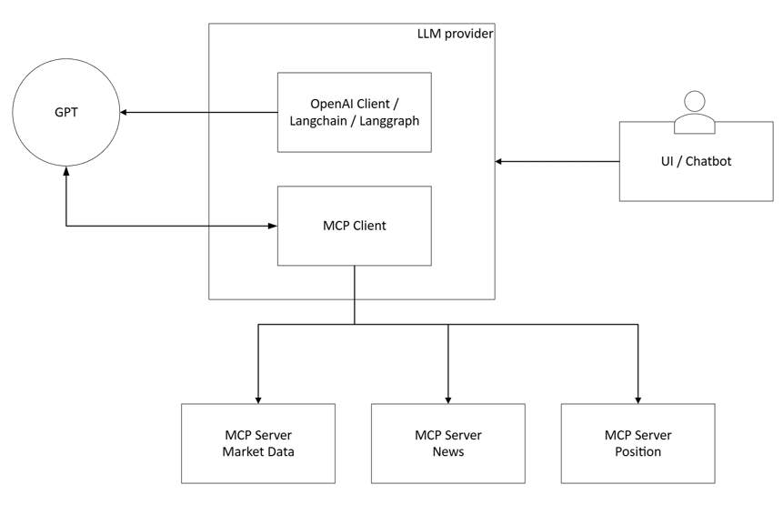

# AI-Powered Market Intelligence

**A Financial Intelligence Agent powered by Gemini & Model Context Protocol (MCP)**

## Project Overview

本项目是一个面向 Risk Manager 和 Trader 的智能辅助系统。它不只是简单的新闻摘要工具，而是致力于构建一个**语义-因子映射层 (Semantic-Factor Mapping Layer)**。

系统利用 **Google Gemini** 的推理能力，结合 **Model Context Protocol (MCP)** 架构，实时连接市场数据与新闻流，将定性的市场情绪（Market Color）转化为定量的风险指标（Risk Indicators），如情绪得分、因子偏度预测和波动率预警。

### 核心价值

* **From Text to Metric:** 将 "谣言驱动上涨" 转化为 "Low Confidence, High Reversal Risk"。
* **Asset Coverage:** 优先覆盖 **A股股票、核心指数 (CSI300/CSI500) 及 指数期货 (IF/IC/IM)**。
* **Architecture:** 基于微服务化的 MCP 架构，解耦 LLM 与数据源。

---

## System Architecture

本项目基于 **Model Context Protocol (MCP)** 标准构建，确保数据源的可扩展性。

* **LLM Provider:** Google Gemini (via LangChain/LangGraph) - 负责逻辑推理与语义分析。
* **Orchestrator:** LangGraph - 管理多轮对话状态与工具调用链。
* **MCP Client:** 负责与各数据服务通信。
* **MCP Servers:**
* `mcp-server-market`: 获取行情数据 (Price, Volume, OI) - 覆盖股票/期货。
* `mcp-server-news`: 获取实时财经新闻与公告。
* `mcp-server-position`: 管理模拟持仓与风险敞口。

---

## Project Roadmap & Delivery Timeline

### Phase 1: Infrastructure & Data connectivity (Dec 19 - Dec 24)

**目标:** 完成 MCP Server 搭建，打通 Gemini 与行情的连接。

* 搭建 `mcp-server-market`，接入 A 股/期货行情 (CSI300, IF合约)。
* 搭建 `mcp-server-news`，接入基础财经新闻流。
* 配置 LangGraph + Gemini 基础环境。

> **Milestone (Dec 21): 基础问答能力**
> * **User:** "Show me the latest price and volume for CSI300 futures (IF2501)."
> * **Agent:** Calls MCP tool -> Returns real-time data.
> * **User:** "What are the latest headlines about 'Lithium batteries'?"
> * **Agent:** Calls News tool -> Returns list of raw news.
> 
> 

### Phase 2: Sentiment Analysis & Mid-Term Demo (Dec 25 - Dec 30)

**目标:** **中期检查交付点。** 实现“新闻 -> 情绪打分”的闭环。

* 实现 `Sentiment Scoring` Prompt Chain (Direction -10 to +10, Confidence 0-1)。
* 初步实现新闻与具体标的（Ticker）的关联。

> **Milestone (Dec 25): 语义理解能力**
> * **User:** "Summarize the overnight market color for the EV sector."
> * **Agent:** "Sentiment is **Positive (+7)** but fragile. Driven by subsidy rumors (Confidence: **Low 0.4**)."
> * **User:** "Why is the confidence low?"
> * **Agent:** "Because the source is unverified social media, implying higher volatility risk."
> 
> 

### Phase 3: Factor Mapping & Quant Indicators (Dec 31 - Jan 5)

**目标:** 核心难点突破。将情绪映射到 Barra 风格因子 (Momentum, Size, Volatility)。

* 开发 `Factor Mapping` 逻辑：文本 -> 因子归类。
* 引入 `mcp-server-position`，结合持仓给出建议。

> **Milestone (TBD): 因子量化能力**
> * **User:** "How does today's tech rally affect my generic risk factors?"
> * **Agent:** "It triggers a **Momentum** positive skew. However, expect **Volatility** to increase by 1.5x due to external divergence."
> 
> 

### Phase 4: Final Polish & Dashboard (Jan 6 - Jan 10)

**目标:** 最终交付。UI 优化与复杂场景测试。

* 完善 Streamlit 前端 UI（展示仪表盘）。
* 综合测试：从新闻输入到最终 Risk Report 的完整链路。

> **Milestone (Jan 10 - Final Delivery): 完整智能体**
> * **User:** "I hold a long position in IF2501. Given the credit tightening news, what should I watch out for?"
> * **Agent:** "Warning: **Liquidity Stress** detected. Credit tightening historically hits the **Leverage Factor**. Recommendation: Monitor the spread between IF and spot; consider hedging if basis widens beyond -10bps."
> 
> 

---

## Tech Stack

* **Language:** Python 3.10+
* **LLM:** Google Gemini
* **Frameworks:**
* `langchain` / `langgraph`: Agent orchestration.
* `mcp`: Model Context Protocol implementation.

* **Data Sources (MCP Servers):**
* *AkShare / Wind API* (Market Data & News)

* **UI:** Streamlit
